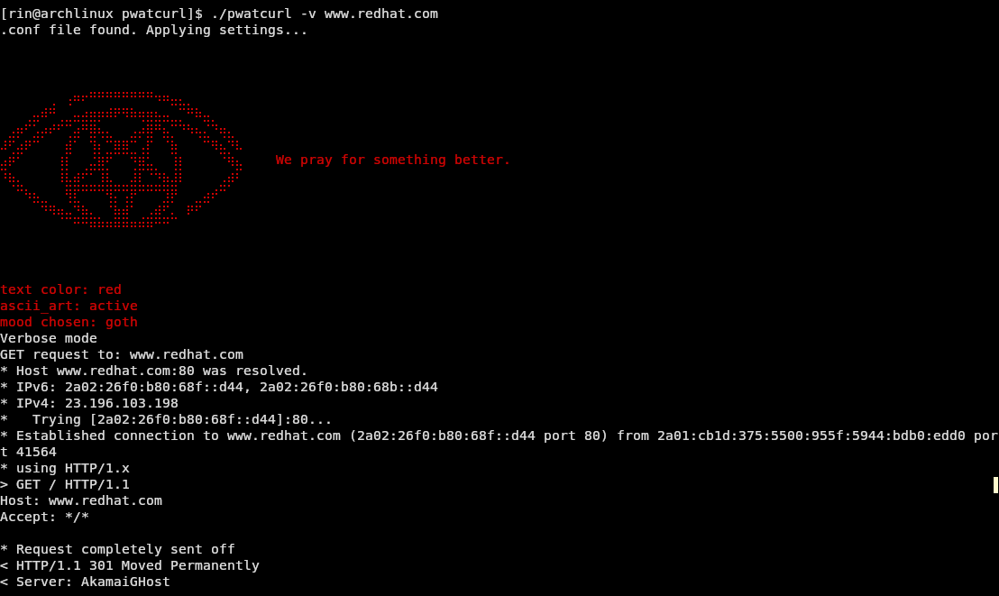

# PwatCurl
A troll version of curl, with a configurable mood and curl's essential features.



### CLI Flags:

#### **Usage : `pwatcurl [options] <url>`**

- `-h, --help` : Show this help message
- `-o <file>` : Write output to file
- `-O, --remote-name` : Save file with remote name. If no remote name is available, it will save output to a default file named `pwatcurl_response.txt`.
- `-L, --location` : Follow redirects
- `-I, --head` : This flag will not only show the HTTP header, but also the IP addresses that it attempted to connect to.
- `-s / -S` : silent & show errors. To be used in combination.
- `-w "%{http_code}"` : print http status code.
- `-v, --verbose` : Verbose mode

Of course, you can chain different flags like this:

```bash
./pwatcurl -sS -o /dev/null -w "%{http_code}" https://rinkakuworks.com
```

#### To be implemented:

- `-X <method>` : specify HTTP method.
- `-d <data>` : POST data.
- `-H "<header: value>"` : custom headers.
- `-i` : include headers in output.

### Configurable mood: 

**Edit the `pwatcurl.conf` to change pwatcurl's behavior!**
- If you enable ASCII art without choosing a mood, pwatcurl refuses to commit to a vibe. No art will be shown.
- If the `pwatcurl.conf` file is missing, it will set itself to a default.

### Files:

- `lib/ascii_art_handler.c` and `lib/ascii_art_handler.h`:
Displays ASCII art, depending on chosen mood.

- `lib/conf_file_parser.c` and `lib/conf_file_parser.h`:
My own C library to parse .conf files, inspired by [Config-Parser-C](https://github.com/welljsjs/Config-Parser-C).
It handles trailing spaces, is case insensitive and ignores inline comments.

- `lib/mood_handler.c` and `lib/mood_handler.h`:
Handles mood and moody message outputs.

- `lib/text_color.c` and `lib/text_color.h`:
Handles text color display on the terminal output.

- `src/config_handler.c` and `src/config_handler.h`:
Applies pwatcurl's settings, depending on what was found by `conf_file_parser`.

- `src/cli_args.c` and `src/cli_args.h`:
Handles the different command line arguments.

- `src/request.c` and `src/request.h`:
Uses libcurl to make the HTTP requests

- `src/main.c`:
Main entry point.

## Setup

- Install the libcurl Development Package

Debian:

```bash
sudo apt install libcurl4-openssl-dev
```

Arch:

```bash
sudo pacman -S curl
```

Then, you can build the program with those steps:

```bash
git clone https://github.com/theflyoccultist/pwatcurl.git
cd pwatcurl
make
sudo make install
```

## Uninstall

```bash
sudo make uninstall
```
